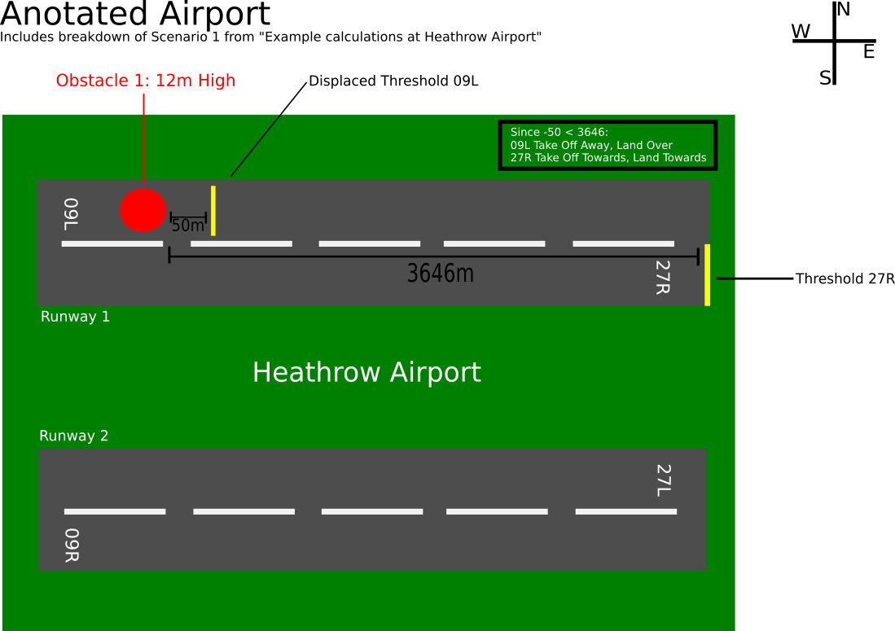

# General Documentation

Any tips or tricks to do with the tool chain can be added here to make it easier for other team members

## Logging Time
- Log time in the current day of the sprint on the [Burndown Chart google sheet](https://docs.google.com/spreadsheets/d/1G_qfX5CQOKYae3K1tQK2OcYnTJN1PDG4_hUfxowC9fE/edit#gid=0 "Burndown Chart")
- This will allow us to generate an accurate burndown chart for the sprint
- Only use multiples of 0.5 when inputting the time you have spent against a task
- If a task is finished then select that from the *Status* column

## Code Style

- [Google Code Style](https://google.github.io/styleguide/javaguide.html)

### Installing the coding style settings in Intellij

Download the intellij-java-google-style.xml file from https://raw.githubusercontent.com/google/styleguide/gh-pages/intellij-java-google-style.xml.

#### Windows

Under File->Settings -> Editor -> Code Style, click on the little gear next to Scheme. Click on import Scheme and select the google-styleguide file as the current code style for the Metanome project. Finish it off by clicking Apply.

#### Mac

Download it and go into Preferences -> Editor -> Code Style. Click on Manage and import the downloaded Style Setting file. Select GoogleStyle as new coding style.

### Installing the coding style settings in Eclipse

Download the eclipse-java-google-style.xml file from the http://code.google.com/p/google-styleguide/ repo. Under Window/Preferences select Java/Code Style/Formatter. Import the settings file by selecting Import.

## Logging
- Log any major changes to the way we work or anything we do as a result of feedback
- Log any big meetings we have

## Trello Usage

### Linking Commits to Tickets on Trello
1. Select the card from the Trello Board
2. Select the GitHub Power up from the right hand menu
3. Attach the relevant thing
  - Branch if its a big feature in development
  - Commit if its a small fix
  - Pull request if it is being merged in to the master branch
4. Click the relevant commit/branch/pull request and it will be added as an attachment

### Trello Boards

#### [Software Engineering Group Project](https://trello.com/b/O5ULHcuC/software-engineering-group-project) 
- Contains all user stories and the sprint we aim to complete them in
- Contains the backlog (technical breakdown) for future sprints

#### [Increment 1](https://trello.com/b/i7dwuDKP/increment-1)  
- Contains the ToDo,Doing,Done columns for this sprint
- Keep track of sprint progress
- Each card is linked to one or many user stories
- Each card can have a checklist that will store the smaller tasks that make it up

## Understanding

